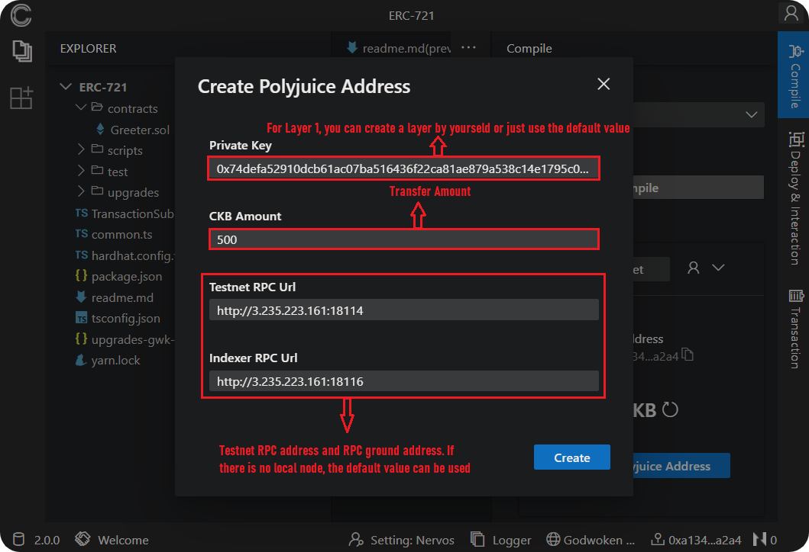

# 1. Nervos IDE Environment Configuration

In this page we have discusses how to configure Nervos IDE environment. Nervos creates a project and adds Godwoken network and creates a Layer2 account to get test coins.

## 1. Create a Nervos Project
First enter the ChainIDE entry page, click Projects, you can view all files, click New Project to create Binance, Chain33, Ethereum, Fabric, Conflux, Dfinity, Nervos chain projects. For now, we'll select Nervos.

Then click the new project button, select Nervos on left, and select a project template on the right to create a Nervos project.

## 2. Configure wallet (add Godwoken network and get test coins)
Nervos IDE provides a one-click button to add Godwoken network, and create a Layer2 account and transfer test coins to godwoken. Click the wallet plug-in button in the lower right corner to open the Nervos IDE wallet plug-in. If your metamask wallet does not have the godwoken network or is not currently on the godwoken network, you can click the "switch" button to add or switch to the Godwoken network.

Then click the Create Polyjuice Address button to create a Layer2 account and transfer the test currency (you can use the layer1 account provided by the IDE, or you can create the layer1 account yourself following this [link](https://github.com/Kuzirashi/gw-gitcoin-instruction/blob/master/src/component-tutorials/1.setup.account.in.ckb.cli.md)).

When you see the terminal prompting success, click refresh button to view the account balance.

## 3. Nervos related links

1. [Godwoken Explorer](https://aggron.layerview.io/zh-CN)
2. [CKB Explorer](https://explorer.nervos.org/aggron/)
3. [Nervos Aggron Faucet](https://faucet.nervos.org/)
4. Set user MetaMask [Godwoken Testnet](https://github.com/nervosnetwork/godwoken-public)

# 2. How to use Nervos IDE?
This page discusses how to set up writing contracts, compiling contract files, deploying, interacting, and querying with smart contract

## 1. Write a Smart Contract
To create a new smart contract we need to click on New File button at the top of the file system, currently supported file types in ChainIDE are  txt', 'sol' , 'md' , 'compiled', 'deployed', 'json',  'txt', 'js', 'css', 'html', 'go', 'sum', and 'mod'. The contract shown in the figure below is a very simple storage contract prepared by ChainIDE for its users. Users can make changes in the built-in template according to their requirements.

## 2. Compile a Smart Contract
Once the user has completed writing down the smart contract, they need to click the Compile button on the right menu bar to open the compilation module, then select the Compiler compilation tool, and then click the Compile Storage.sol button to compile the solidity file. After the compilation is successful, the following ABI and bytecode contents will appear, and at the same time, it will be displayed on the console. Compile contract success is output.

## 3. Deploy a Smart Contract
To deploy a smart contract, a user needs to click the Deploy& Interaction button on the right, the compilation page, and the interaction page will appear, set the gas limit and gas price, and then click Deploy and sign the Metamask at the same time. You can also click the Import Deployed Contract button to fill in the contract correlation information and click Import to import the deployed contract. The successful deployment will display contract-related information on the console and contract-related information on the interactive page.

## 4. Contract Interaction

After the contract is successfully deployed, we need to interact with the contract deployed on the chain to obtain our own wallet address. If the interaction is successful, the log information will be printed on the console. Click the Get button to return the result interaction information. (Query, copy, and delete buttons can perform corresponding operations on the contract).

## 5.  Contract Query

Click the Transaction button on the right to display the transaction details page, where you can view the specific information of each transaction. Select one of the contracts and click the more button to view specific information.

